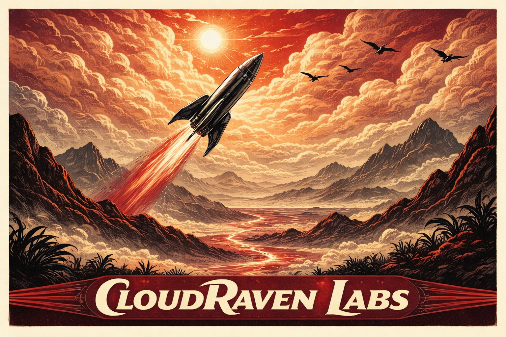

# CloudRaven Development Guidelines

<p align="center">
  
</p>

<p align="center">
  
</p>

This repository is the CloudRaven engineering equivalent of an organizational design guide.

It is a docs-first development-guidelines library for CloudRaven services: a shared source of truth for dependency choices, implementation patterns, prototype-to-production standards, integration cautions, and agent-friendly development context. The goal is to make CloudRaven service development more consistent, more searchable, and easier to support collaboratively across repos.

It does not add runtime code, package installs, or app scaffolding. Instead, it focuses on:

- collecting official documentation entry points for important dependencies
- capturing extracted markdown from those sources
- distilling that material into reusable enriched notes and dependency briefs
- defining how knowledge should be persisted in the repo
- providing a local retrieval workflow for collaborators and coding agents

**What This Repo Is**
A standards and knowledge layer for CloudRaven engineering work.

- `knowledgebase/store/extracted/` is source-backed reference material
- `knowledgebase/store/enriched/` is CloudRaven interpretation of source material
- `knowledgebase/dependencies/` is higher-level guidance for dependency and service decisions
- `knowledgebase/manifests/` is the collection control layer
- `scripts/` is the maintenance and retrieval workflow

**What Is Included**
This starter already includes example knowledge across the kinds of systems CloudRaven services are likely to touch:

- application foundation examples such as AWS Amplify Gen 2 for Next.js
- AI and media examples such as OpenAI, ElevenLabs, and Pexels
- UI system examples such as HeroUI, shadcn/ui, and Tailwind CSS
- identity and event examples such as Google Identity, Gmail and Calendar push flows, and Microsoft Entra ID with Graph notifications
- visualization examples such as MapLibre GL JS, Apache ECharts, and Three.js
- billing and event-routing examples such as Stripe and EventBridge

This repository also includes CloudRaven brand assets in [`assets/`](./assets):

- `cloudraven-logo-black-01.svg`
- `cloudraven-logo-only-blue.svg`
- `cloudraven-logo-only.svg`
- `cloudraven-rocket.png`

**Start Here**

- [Knowledgebase Index](./knowledgebase/README.md)
- [Collection Workflow](./knowledgebase/collection-workflow.md)
- [Dependency Manifest](./knowledgebase/dependency-manifest.md)
- [Agentic Doing Playbook](./knowledgebase/agentic-doing-playbook.md)
- [Original Project Brief](./SUMMARY.md)

**Repository Layout**

```text
knowledgebase/
  dependencies/   higher-level CloudRaven guidance by capability or service area
  manifests/      collection inputs and generated URL manifests
  store/
    extracted/    source-backed markdown captured from docs or manual imports
    enriched/     distilled CloudRaven notes derived from source material
    raw_html/     local-only source snapshots
  templates/      reusable note templates
scripts/
  collect_docs.py
  sync_knowledge.py
  build_search_index.py
  search_knowledge.py
assets/
  logos and brand artwork used by this repo
```

**How To Think About The Contents**

- `extracted` should answer: what did the source say?
- `enriched` should answer: what matters for CloudRaven?
- `dependencies` should answer: when do we use this, avoid this, or revisit this?
- manifests and scripts should keep the system maintainable and reproducible

**How This Helps CloudRaven**

- gives teams a shared development guide for CloudRaven service work
- reduces repeated research across repos and projects
- makes agentic development more grounded in repo-local knowledge
- preserves manually gathered knowledge as durable markdown instead of temporary chat context
- creates a path from prototype decisions to production standards

**Using This In Another Repo**

1. Copy the knowledgebase structure and scripts into the target repository.
2. Move it into `/docs/knowledgebase` if that repo uses a docs folder convention.
3. Update [`knowledgebase/manifests/collection-targets.json`](./knowledgebase/manifests/collection-targets.json) for that repo's actual stack.
4. Collect and curate the docs that matter for the repo.
5. Commit the shared markdown knowledge so anyone with repo access can use it.

**Core Commands**

```bash
python3 scripts/collect_docs.py
python3 scripts/sync_knowledge.py
python3 scripts/build_search_index.py
python3 scripts/search_knowledge.py "your query"
```

Shorter command wrappers:

```bash
make kb-sync
make kb-collect targets=openai-api
make kb-search q="auth webhook production risks"
```

**Recommended Git Policy**

Track in git:

- `knowledgebase/**/*.md`
- `knowledgebase/manifests/`
- `knowledgebase/dependencies/`
- `scripts/`
- `assets/`

Keep local-only:

- `knowledgebase/store/raw_html/`
- `knowledgebase/index/`

Why:

- shared markdown is the canonical team knowledge
- raw source snapshots are rebuildable and noisy
- retrieval indexes are generated local artifacts

**Manual Markdown Placement**

- Put manually captured source material in `knowledgebase/store/extracted/<target>/`
- Put distilled, repo-usable summaries in `knowledgebase/store/enriched/<target>/`
- Put higher-level dependency or capability guidance in `knowledgebase/dependencies/`
- If you want a source to be recollectable later, add or update the target in `knowledgebase/manifests/collection-targets.json`

**What Should Be Collected**

- official docs for important dependencies and services
- setup, quickstart, and API reference pages that affect implementation
- auth, billing, webhook, storage, deployment, quota, retry, and permissions guidance
- manually captured notes from pasted docs, PDFs, screenshots, or internal documentation when they materially affect the repo

Avoid collecting by default:

- marketing pages
- low-impact package docs with little architectural or operational value
- large undifferentiated doc dumps that do not improve decision-making or implementation speed

**Update Workflow**

If you manually add or edit markdown:

```bash
python3 scripts/sync_knowledge.py
```

If you collect new docs from URLs:

```bash
python3 scripts/collect_docs.py
python3 scripts/sync_knowledge.py
```

Typical search usage:

```bash
python3 scripts/search_knowledge.py "shadcn theming components json"
python3 scripts/search_knowledge.py "amplify auth production risks"
python3 scripts/search_knowledge.py "stripe eventbridge webhook pattern"
```

**Common Adoption Steps**

- move the knowledgebase into `/docs/knowledgebase` when integrating it into an application repo
- replace the sample dependency briefs and manifests with the actual stack for the target repository
- expand the guideline layers so CloudRaven defaults are clearer over time
